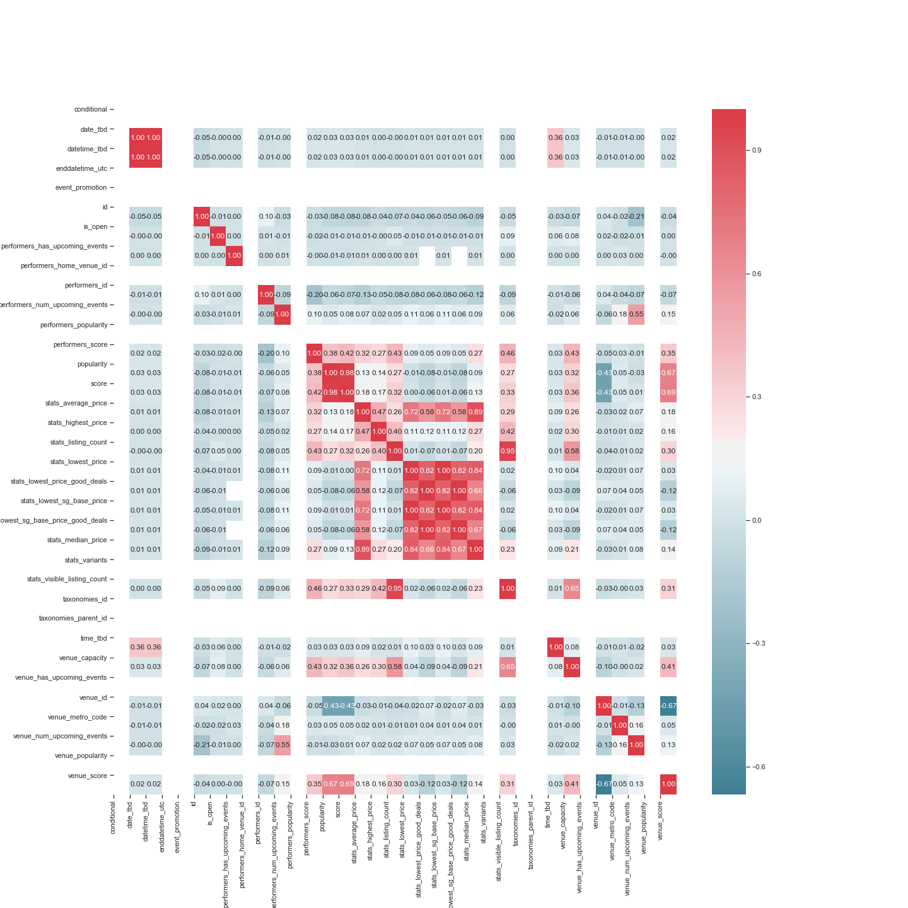
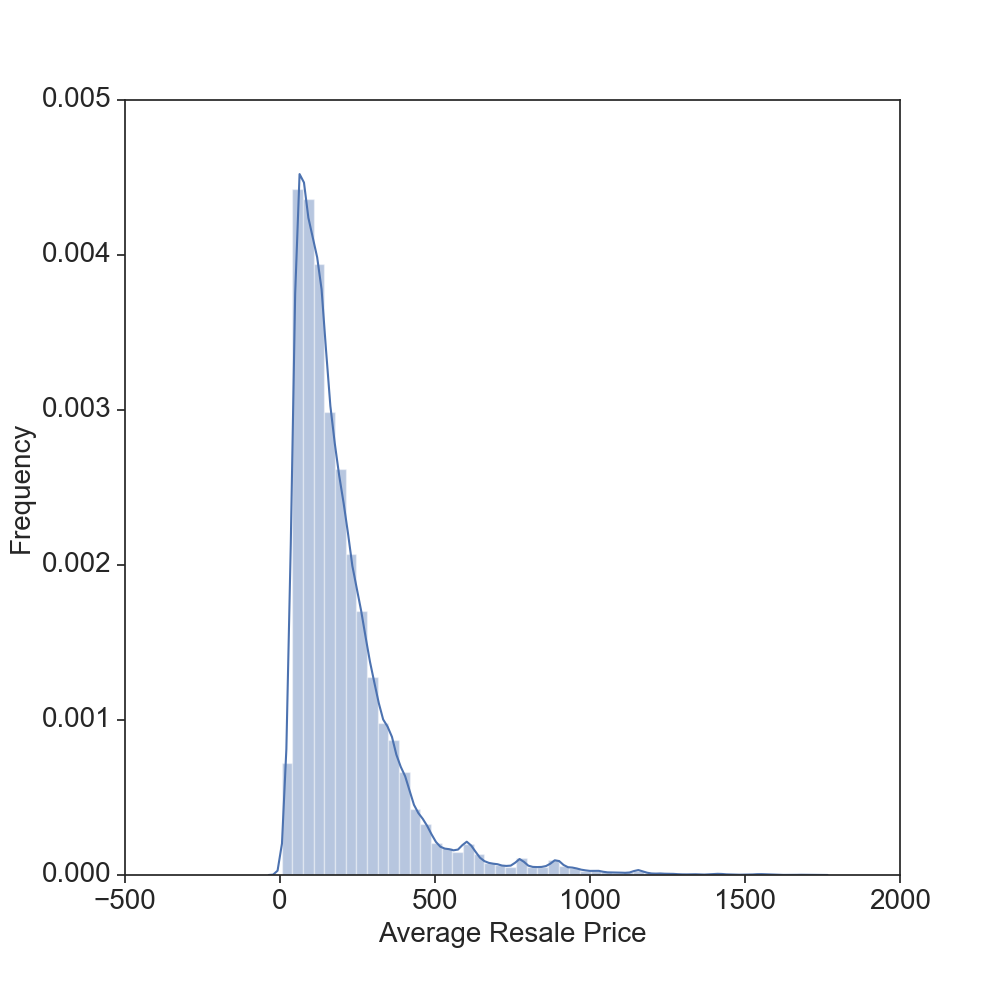
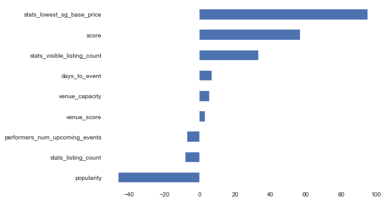
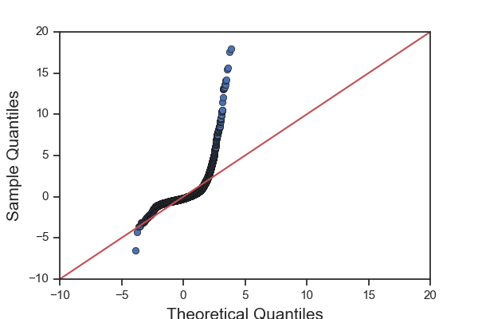
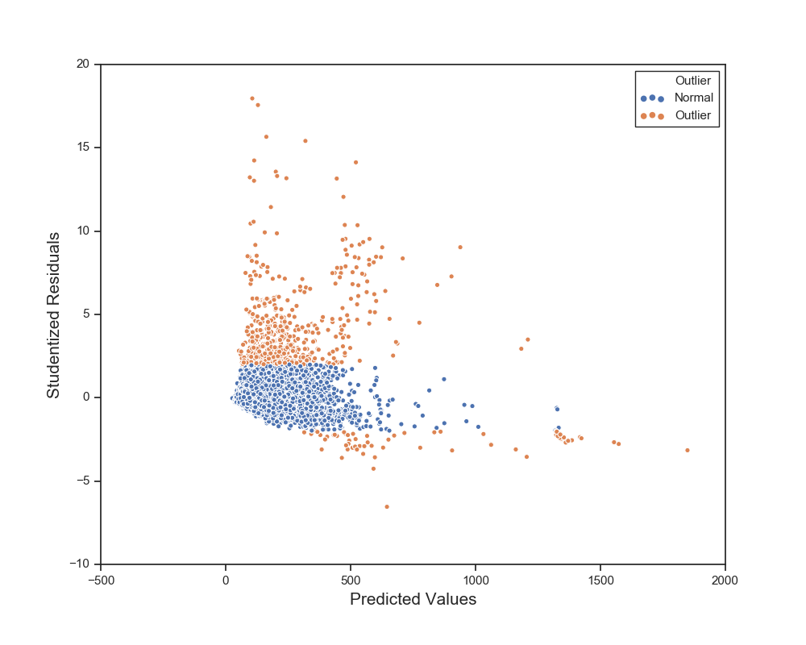
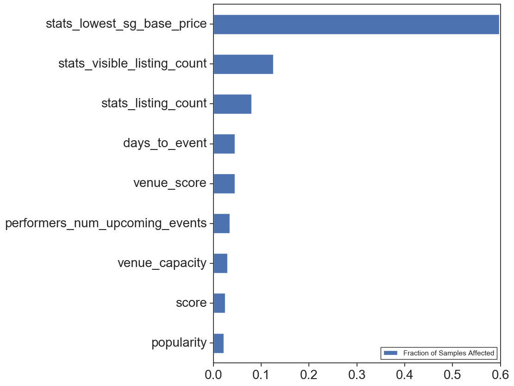

# Resale Ticket Pricing by Music Genres

by[Linh Chau](https://www.linkedin.com/in/linhchau/)

A statistical analysis and model of ticket resale prices using concert features and musical features. The ticket resale market in the US is estimated to be a 5 billion dollar market. Given the size of the industry, it's important to understand how to sell tickets in a fashion that will find you a buyer but also not to leave money off the table. Therefore, I'm interested in the different factors that relate to the average resale price of concert tickets. 

## Project Goal
Predict average ticket resale prices with features covering the concert, itself, and musical features of the artist.

## Dataset and Methods
Used the SeatGeek API to retrieve information on ticket resales and the Spotify API to retrieve information on musical features of artists playing concerts.  

    - Number of concerts: 30,634 (10/08/2019 to 12/31/2029, US Events)
        - 90 features: Concert Announcement Info, Venue Information, Price Information, Performer Information, etc.
    - Number of Musical Acts: 7,609
    - Songs by Performing Musical Acts: 643,457
        - Spotify generated muscical features: Music Energy, Danceability, etc. 

I aggregated the data using the mean to come up with an average resale price across all concerts for a respective artist. To come up with a musical profile, all songs in an act's discography was averaged together. 

Also, I modeled the concert data with just the features from SeatGeek. 

Tools: Python, Numpy, Pandas, Matplotlib, Scipy, Seaborn, Spotipy, Jupyter Notebook, Sklearn, Glob, StatsModels, Multiprocessing

## Results and Insight

### Does music genre affect resale ticket prices?

There is a significant difference in the average ticket resale price between concerts of different genres (Kruskal-Wallis Test: H = 318.94; p-value = 6.41e-59). Punk concerts have the lowest resale price (mean: 60.0); while Pop, Country, Blues, and Latin concerts have high resale prices. 

### How do tickets for concert residencies compare to concerts on tour?

When I was looking at individual artists (ie. Dionne Warwick, The Lumineers, etc), I noticed that there was not much variation in average ticket price over time for artists that performed at the same venue multiple times and those that toured. Therefore, I wanted to look at the difference in average ticket resale price between the two groups. 

Residency concerts have higher average resale price than touring concerts (Mann-whitney-u (statistic=18467363.0, pvalue=1.84e-156)

### Predicting Resale Ticket Prices

### Feature Selection

I'm interested in average price of a resale ticket. In preliminary EDA, I saw that musical features had small correlations with average resale price, so I removed them when performing feature selection. When looking at the different ticket features and their correlation to average resale price, it seems like there were many features that seem intresting: 

    - Base ticket price
    - venue_capacity
    - venue_score
    - Number of future performances from the artist
    - etc.

Given the number of features, I'll take a multiprong approach. I'll use linear regression to get an understanding of what features help explain the variance in average resale ticket price. I'll create preliminary models with a few features and then I'll use LASSO/L1 Regularization to help with feature selection. I'll use random forest to create a predictor of average resale price. 

Let's look at the distribution of the target to get an idea of potential transformations. The price has a long right tail. The mean resale ticket price is $203.50. 

Performed a test-train-split to test my models.

#### Linear Regression and LASSO/L1 Regularization
Standardized Features using Standard Scaler. Performed LASSO for feature selection with default features and then performed GridSearch to find alpha. Grid search identified 0.01 as the best alpha. Using that alpha, I did Lasso regularization. 

    training score: 0.6190965505027437
    test score: 0.642887359517254
    number of features used: 9

However, when examining the QQ plot and Residuals for this model, it seems like this model doesn't follow the assumptions of Linear regression. 

 

Probably safe not to make insight based off of this model...

#### Random Forest
Let's try switching our focus onto prediction verse inference! Used a Random forest model, with default features. Also used grid search parameters, though, they did not outperform the first model. 

`RandomForestRegressor(bootstrap=True, criterion='mse', max_depth=None,
                      max_features='auto', max_leaf_nodes=None,
                      min_impurity_decrease=0.0, min_impurity_split=None,
                      min_samples_leaf=1, min_samples_split=2,
                      min_weight_fraction_leaf=0.0, n_estimators=1000,
                      n_jobs=None, oob_score=False, random_state=0, verbose=0,
                      warm_start=False)`

Given these parameters, this random forest got an accuracy score on the test data set of accuracy = 0.7683850008980327. 

Here are the important features from Random Forest model. 

 

## Conclusions
Though, these models were unable to get a high accuracy when predicting average concert resale ticket price. It gave some information that base ticket price may be important when pricing concert tickets for resale. In the future, I'd like to gain more domain knowledge to get more features that may explain more variance in average resale ticket prices. 

## References
https://www.cnbc.com/2015/03/04/online-ticket-resellers-the-surreptitious-rise-of-the-online-scalper.html
