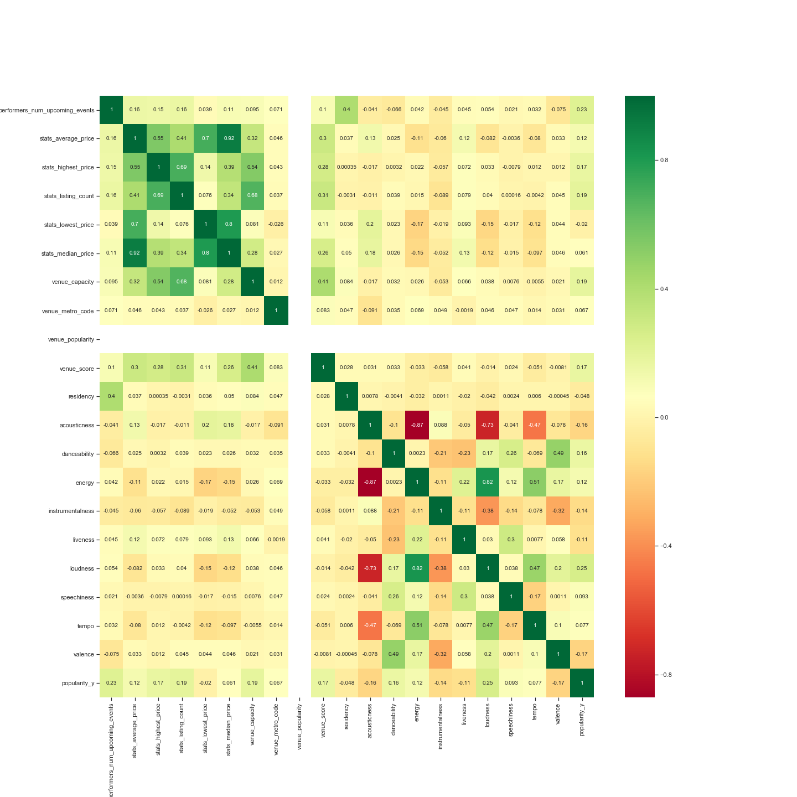

# Resale Ticket Pricing by Music Genres

A statistical analysis and model of ticket resale prices using concert features and musical features. The ticket resale market in the US is estimated to be a 5 billion dollar market. Given the size of the industry, it's important to understand how to sell tickets in a fashion that will find you a buyer but also not to leave money off the table. Therefore, I'm interested in the different factors that relate to the average resale price of concert tickets. 

## Project Goal
Predict average ticket resale prices with features covering the concert, itself, and musical features of the artist.

## Dataset and Methods

Used the SeatGeek API to retrieve information on ticket resales and the Spotify API to retrieve information on musical features of artists playing concerts.  

    - Number of concerts: 30,634 (10/08/2019 to 12/31/2029, US Events)
    - Number of Musical Acts: 7,609
    - Songs by Performing Musical Acts: 643,457

I aggregated the data using the mean to come up with an average resale price across all concerts for a respective artist. To come up with a musical profile, all songs in an act's discography was averaged together. 

Tools: Python, Numpy, Pandas, Matplotlib, Scipy, Seaborn, Multiprocessing, Spotipy, Jupyter Notebook

## Results and Insight

### Does music genre affect resale ticket prices?

There is a significant difference in the average ticket resale price between concerts of different genres (Kruskal-Wallis Test: H = 318.94; p-value = 6.41e-59). Punk concerts have the lowest resale price (mean: 60.0); while Pop, Country, Blues, and Latin concerts have high resale prices. 

### How do tickets for concert residencies compare to concerts on tour?

When I was looking at individual artists (ie. Dionne Warwick, The Lumineers, etc), I noticed that there was not much variation in average ticket price over time for artists that performed at the same venue multiple times and those that toured. Therefore, I wanted to look at the difference in average ticket resale price between the two groups. 

Residency concerts have higher average resale price than touring concerts (Mann-whitney-u (statistic=18467363.0, pvalue=1.84e-156)

### Feature Selection

I'm interested in average price of a resale ticket. When looking at the different features and their correlation to average resale price, it seems like there are a couple features that seem intresting (though correlations are a bit low): 

    - performers_num_upcoming_events
    - venue_capacity
    - venue_score
    - acouticness
    - energy
    - liveness
    - streaming popularity

### Predicting Ticket Prices

#### Random Forest

## Conclusions

## References
https://www.cnbc.com/2015/03/04/online-ticket-resellers-the-surreptitious-rise-of-the-online-scalper.html
